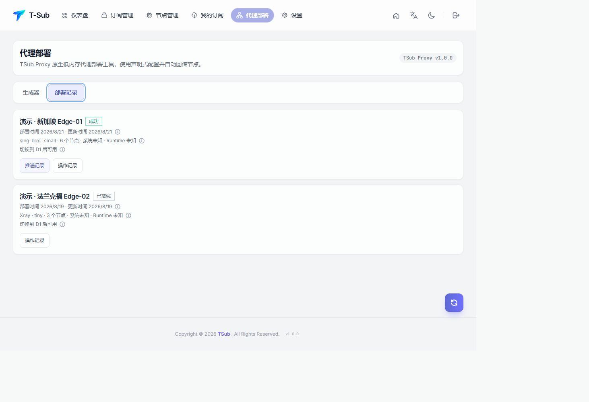

[English](README_EN.md)

<p align="center"></p>

# TSub

TSub 是可部署在 Cloudflare Pages 或自有服务器上的订阅与代理节点管理平台，包含订阅管理、节点管理、Profile、多客户端转换、代理部署、远程 Agent、本机执行器、通知、备份和外部管理 API。


## 核心能力

- 管理 HTTP 订阅源、手动节点和可公开分享的 Profile。
- 输出 Base64、Clash/Mihomo、sing-box、Surge、Loon、Quantumult X 等格式。
- 使用操作符链、规则模板、节点筛选、排序、去重和名称处理构建订阅。
- 使用 TSub Proxy 在低内存服务器部署 Xray 或 sing-box，不保存 SSH 账号或私钥。
- 通过一次性 Bootstrap、加密部署配置、主动推送和 HTTPS 镜像同步节点及总流量。
- Cloudflare 支持 KV 基础模式与 D1 完整模式；服务器支持 SQLite WAL 单机模式与 PostgreSQL 多实例模式。
- 提供中英文界面、桌面和移动端布局，以及完全隔离的只读演示数据。

## 界面预览

| 订阅管理 | 节点管理 |
| --- | --- |
|  |  |

| 我的订阅 | 代理部署记录 |
| --- | --- |
|  |  |

| 代理部署 | 设置 |
| --- | --- |
|  |  |

## Cloudflare Pages 部署教程

推荐先 Fork 本仓库，再在 Cloudflare 中授权 GitHub 并选择自己的公开 Fork。完整的逐步配置、D1/KV 绑定、Secrets、首次登录和故障排查见[GitHub 授权部署教程](docs/QUICK_START.md)。

构建命令使用 `npm run build`，输出目录使用 `dist`，Node.js 版本使用 22 或更高。Fork 后必须在自己的 Cloudflare 账号中创建并绑定 `TSUB_DB` 或 `TSUB_KV`；仓库中的 `wrangler.toml` 资源 ID 属于示例生产账号，不能直接复用。

### GitHub 授权部署步骤

1. **Fork 仓库**：打开本仓库的 GitHub 页面，点击 **Fork**，建议保持 Fork 为公开仓库。
2. **创建 Pages 项目**：进入 **Workers 和 Pages → 创建应用程序 → Pages → 导入现有 Git 存储库**。如果先显示 Worker 卡片，点击“想要部署 Pages？开始使用”，然后授权 GitHub 并选择 Fork。
3. **填写构建设置**：项目名可填写 `tsub`，生产分支为 `main`，构建命令为 `npm run build`，输出目录为 `dist`，Node.js 使用 22 或更高版本。
4. **创建并绑定存储**：推荐创建 D1 数据库并绑定为 `TSUB_DB`。如果只需要订阅管理，也可以创建 KV 命名空间并绑定为 `TSUB_KV`。绑定名必须完全一致，Fork 必须使用自己的资源 ID。
5. **配置变量和密钥**：在 **设置 → 变量和密钥** 中选择生产环境。可以手动点击 **添加变量**，也可以点击 **导入 .env**。

手动配置时添加以下 6 项；密码和加密密钥选择 **密钥（Secret）**：

| 名称 | 说明 |
| --- | --- |
| `ADMIN_USERNAME` | 管理员账号名，3-32 位 |
| `ADMIN_PASSWORD` | 管理员密码，至少 8 位、最多 128 位 |
| `COOKIE_SECRET` | 登录 Cookie 签名密钥 |
| `DEPLOYMENT_SECRET_KEY` | 代理部署配置密钥 |
| `SETTINGS_SECRET_KEY` | 设置、通知和外部 API 密钥 |
| `TSUB_PUBLIC_URL` | 公开 HTTPS 地址，例如 `https://tsub.example.com` |

`.env` 导入模板：

```dotenv
ADMIN_USERNAME=这里填写管理员账号名
ADMIN_PASSWORD=这里填写管理员密码（至少8位）
COOKIE_SECRET=这里填写随机Cookie密钥
DEPLOYMENT_SECRET_KEY=这里填写随机部署密钥
SETTINGS_SECRET_KEY=这里填写随机设置密钥
TSUB_PUBLIC_URL=这里填写公开HTTPS地址
```

导入后确认目标环境为 **生产（Production）**，敏感项为 **密钥（Secret）**。填写后的 `.env` 不得提交到 GitHub。

6. **部署和验证**：点击 **保存并部署**，等待 `npm run build` 和 Functions 发布完成。打开 `https://你的项目.pages.dev/login` 登录，进入 TSub 的 **设置 → 系统设置**，确认活动存储为 D1 或 KV；D1 模式还应显示远程 Agent 和部署命令能力。


完整的 D1/KV 创建、绑定、截图和故障排查见[完整 GitHub 授权部署教程](docs/QUICK_START.md)。

## 服务器部署

服务器部署运行的是完整的 TSub 主控，适合需要 SQLite/PostgreSQL、远程 Agent 或本机执行器的场景。支持 Docker Compose 和 Debian/Ubuntu/Alpine 裸机安装；Web 主控默认使用非 root 用户运行，root 执行器仅在启用本机代理控制时安装。

### Docker Compose（推荐）

要求 Linux `amd64`/`arm64`、Docker Engine、Compose v2，以及一个已经指向服务器的域名。先获取源码并生成 `.env`：

```bash
git clone https://github.com/btjidi/TSub.git
cd TSub
TSUB_DOMAIN=tsub.example.com sh scripts/init-controller-env.sh
docker compose config
docker compose up -d --build
docker compose ps
```

初始化脚本会生成管理员密码和三个独立加密密钥，并只在终端显示一次密码；请立即保存。Compose 对外提供 `80/443`，内部主控端口 `8787` 不应暴露到公网。验证部署：

```bash
curl -I https://tsub.example.com/login
docker compose logs --tail=100 controller caddy
```

### Debian/Ubuntu/Alpine 裸机

裸机方式需要 Node.js 22、npm、Git、SQLite 原生依赖和 systemd/OpenRC。安装器会创建受限的 `tsub-controller` 用户、生成环境文件并注册服务：

```bash
git clone https://github.com/btjidi/TSub.git
cd TSub
TSUB_DOMAIN=tsub.example.com sh scripts/install-controller.sh
```

部署前放行 `80/TCP`、`443/TCP`（需要 HTTP/3 时再放行 `443/UDP`），不要开放 `8787`。首次登录后在“设置 → 系统设置”确认活动存储，并立即导出备份。

完整的环境变量、HTTPS、执行器、PostgreSQL、多实例、升级和备份步骤见[服务器主控部署](docs/SERVER_DEPLOYMENT.md)，架构说明见[总体架构](docs/ARCHITECTURE.md)。

## 本地开发

```bash
npm ci
npm run dev
npm run test:run
npm run build
```

Pages Functions 本地联调：

```bash
npm run dev:server -- --ip 127.0.0.1 --kv TSUB_KV --persist-to .wrangler/state-local
```

## 文档

- [快速开始](docs/QUICK_START.md)
- [用户指南](docs/USER_GUIDE.md)
- [代理部署](docs/PROXY_DEPLOYMENT.md)
- [服务器主控部署](docs/SERVER_DEPLOYMENT.md)
- [总体架构](docs/ARCHITECTURE.md)
- [API 参考](docs/API_REFERENCE.md)
- [数据模型](docs/DATA_MODEL.md)
- [安全模型](docs/SECURITY.md)
- [运维手册](docs/OPERATIONS.md)
- [开发指南](docs/DEVELOPMENT.md)

许可证：[MIT](LICENSE) · 来源参考：[MiSub](https://github.com/imzyb/MiSub)
