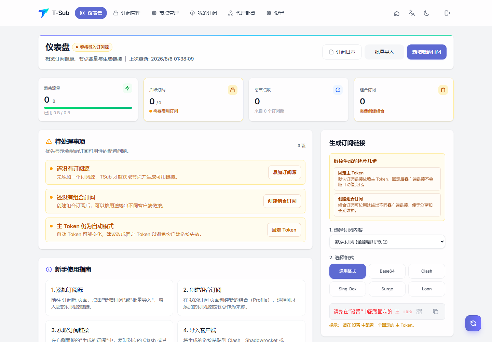
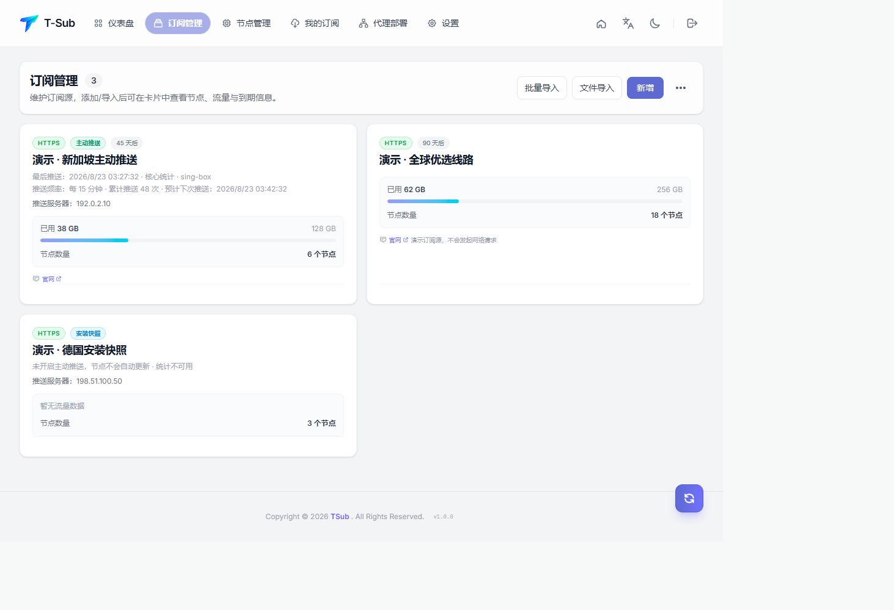
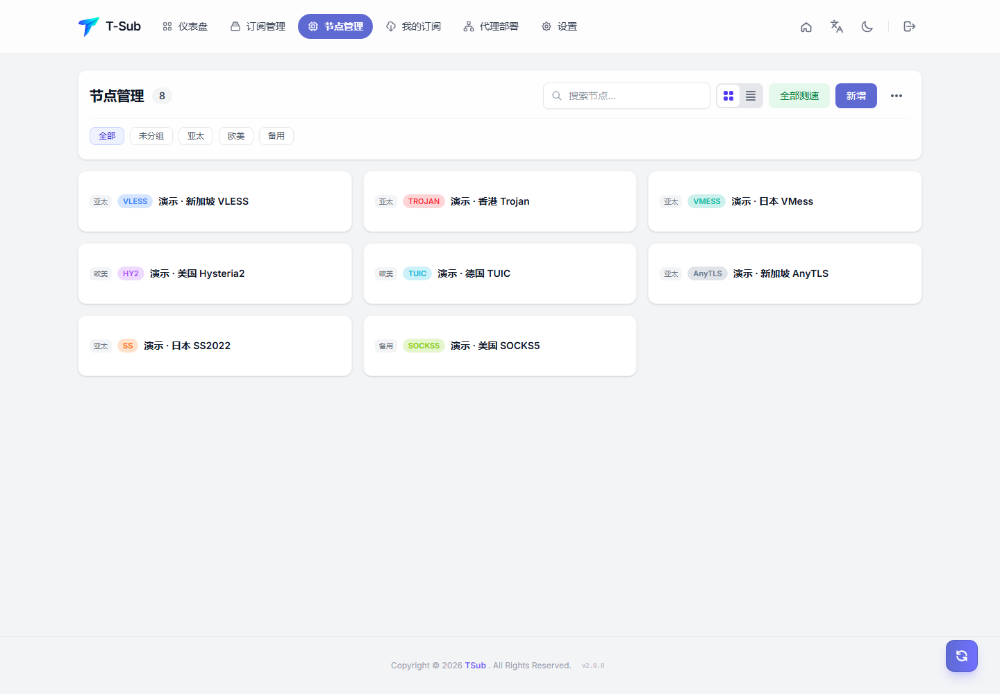
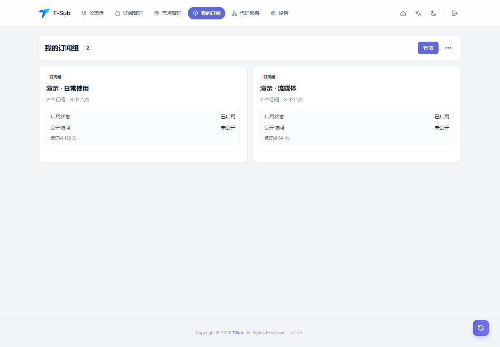
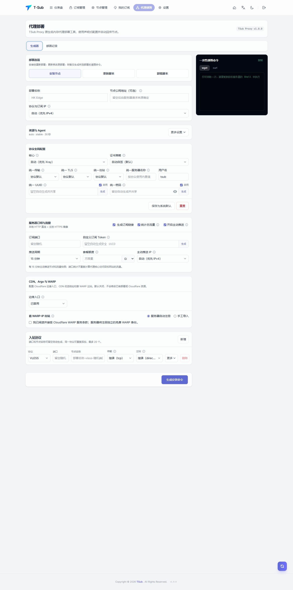

[简体中文](README.md)

<p align="center"></p>

# TSub

TSub is a subscription and proxy-node management platform for Cloudflare Pages or a self-hosted server. It includes Profiles, conversion, proxy deployment, remote agents, local execution, notifications, backups, and an external management API.



## Core capabilities

- Manage HTTP sources, manual nodes, and shareable Profiles.
- Produce Base64, Clash/Mihomo, sing-box, Surge, Loon, and Quantumult X output.
- Build subscriptions with operator chains, rule templates, filtering, sorting, deduplication, and renaming.
- Deploy Xray or sing-box to low-memory servers with TSub Proxy, without storing SSH credentials.
- Synchronize nodes and aggregate traffic through one-time Bootstrap tokens, encrypted deployment configuration, active push, and HTTPS mirrors.
- Use Cloudflare KV basic mode or D1 full mode; self-host with single-instance SQLite WAL or multi-instance PostgreSQL.
- Use the Chinese/English responsive interface and fully isolated read-only demo data.

## Interface preview

| Subscription management | Node management |
| --- | --- |
|  |  |

| My subscriptions | Proxy deployments |
| --- | --- |
|  |  |

## Cloudflare Pages Deployment Guide

Fork this repository first, then authorize GitHub in Cloudflare and select your public fork. This README contains the complete deployment tutorial for build settings, D1/KV bindings, Secrets, first sign-in, and troubleshooting.

> [!CAUTION]
> Storage configuration now uses **Cloudflare dashboard bindings**. The public repository no longer ships an active `wrangler.toml` because Pages locks dashboard bindings whenever that file is detected. Select resources owned by your account under Pages **Settings → Bindings**; older forks must remove their existing `wrangler.toml` after syncing.

Use `npm run build` as the build command, `dist` as the output directory, and Node.js 22 or later. `wrangler.example.toml` is local reference only. Every fork must create and bind its own `TSUB_DB` or `TSUB_KV` resources in its Cloudflare Pages project.

The server controller supports Docker Compose and bare-metal Debian, Ubuntu, or Alpine. Its web process is unprivileged and delegates host changes to a separate root executor. Node installers first probe the controller, then use the AWS Global API (`https://checkip.global.api.aws`) and Akamai (`https://whatismyip.akamai.com`) as IPv4/IPv6 fallbacks. These report egress IPs, so confirm the reachable address manually behind NAT or proxies. See [Server Controller Deployment](docs/SERVER_DEPLOYMENT_EN.md) and [Architecture](docs/ARCHITECTURE_EN.md).

### Release Notes

Current version `1.0.6`: added AWS/Akamai IPv4/IPv6 fallback probing for self-hosted node deployment, clearer controller probe errors, immediate handling for HTTP 400/401/403, and manual public-address fallback.

## Local development

```bash
npm ci
npm run dev
npm run test:run
npm run build
```

For local Pages Functions:

```bash
npm run dev:server -- --ip 127.0.0.1 --kv TSUB_KV --persist-to .wrangler/state-local
```

## Documentation

- [Cloudflare Pages deployment tutorial](#cloudflare-pages-deployment-guide)
- [User Guide](docs/USER_GUIDE_EN.md)
- [Proxy Deployment](docs/PROXY_DEPLOYMENT_EN.md)
- [Server Controller Deployment](docs/SERVER_DEPLOYMENT_EN.md)
- [Architecture](docs/ARCHITECTURE_EN.md)
- [API Reference](docs/API_REFERENCE_EN.md)
- [Data Model](docs/DATA_MODEL_EN.md)
- [Security Model](docs/SECURITY_EN.md)
- [Operations](docs/OPERATIONS_EN.md)
- [Development](docs/DEVELOPMENT_EN.md)

License: [MIT](LICENSE) · Reference: [MiSub](https://github.com/imzyb/MiSub)
