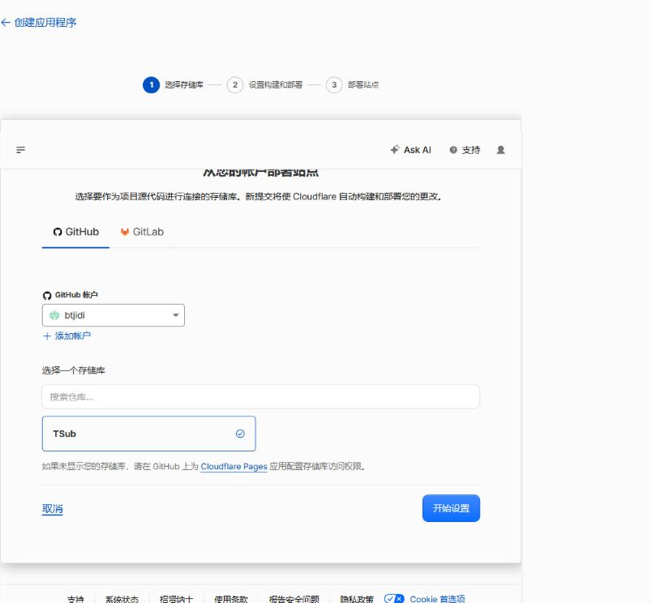
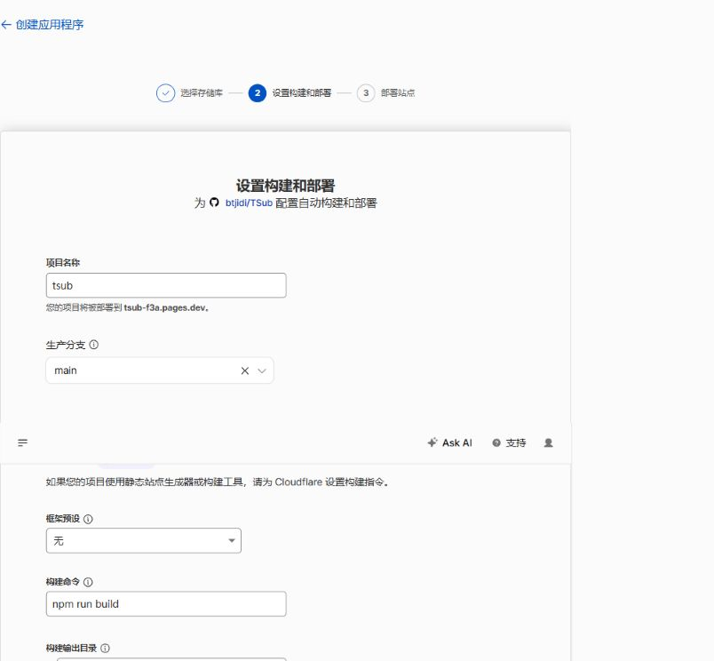
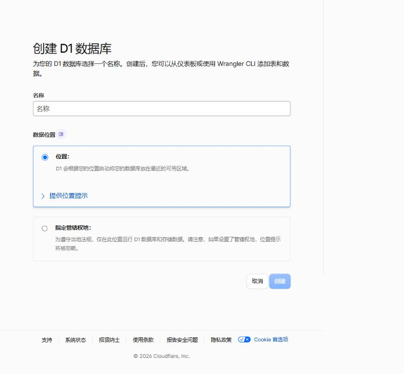
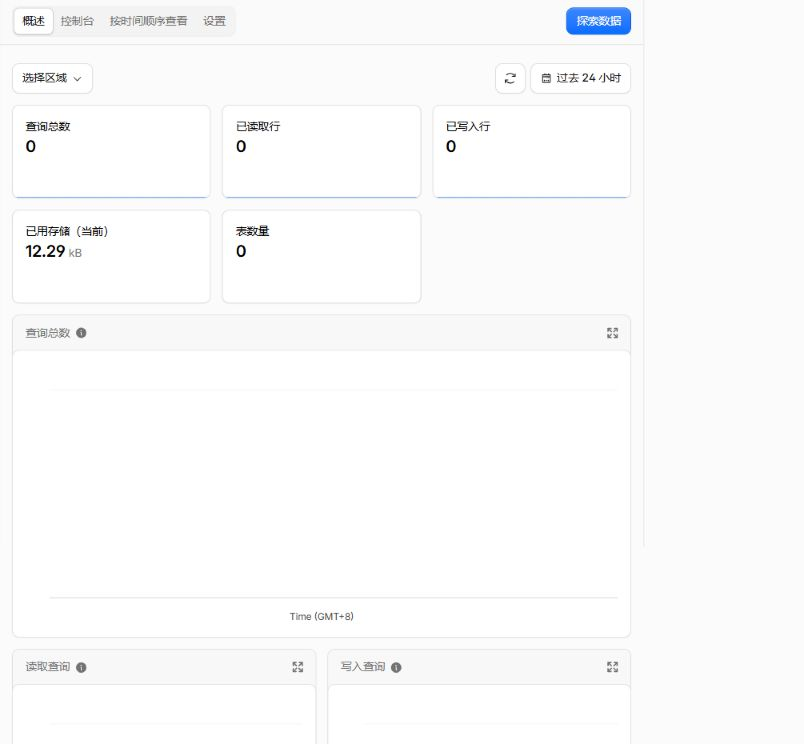
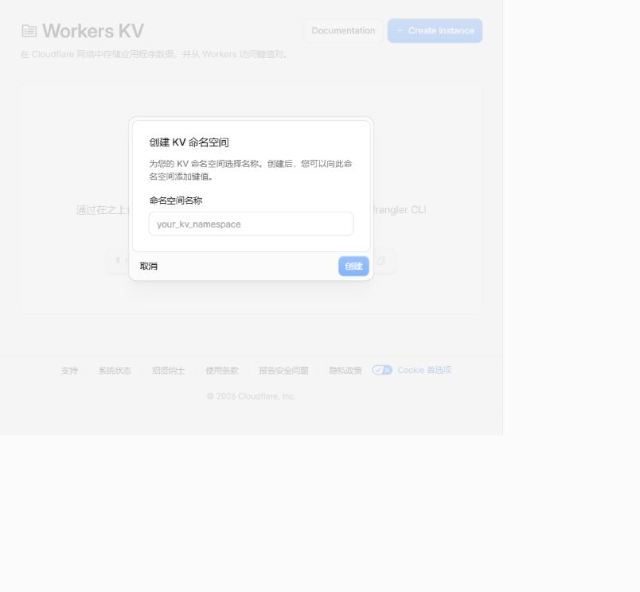
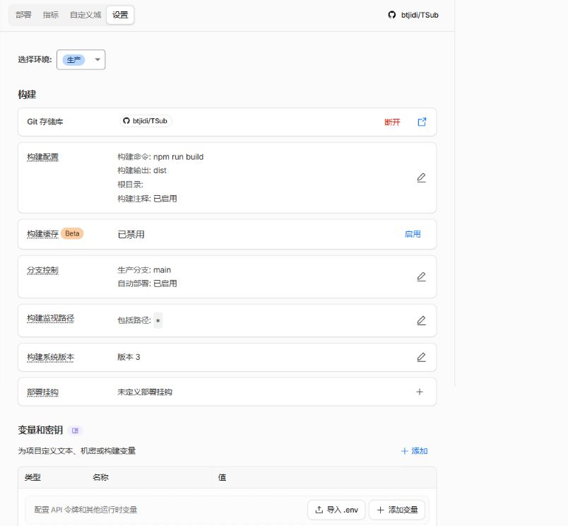
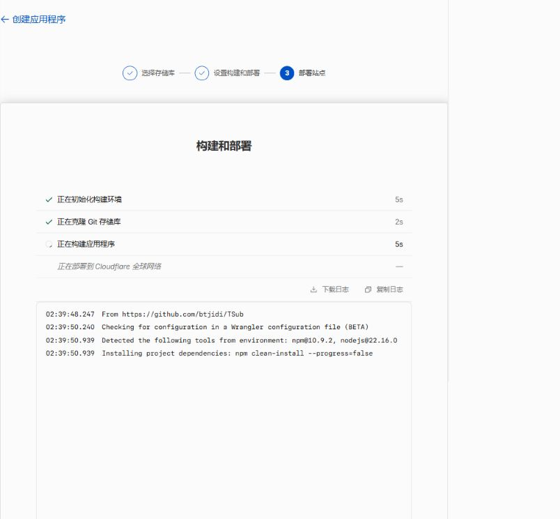
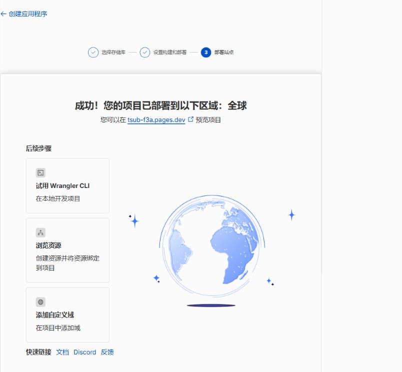
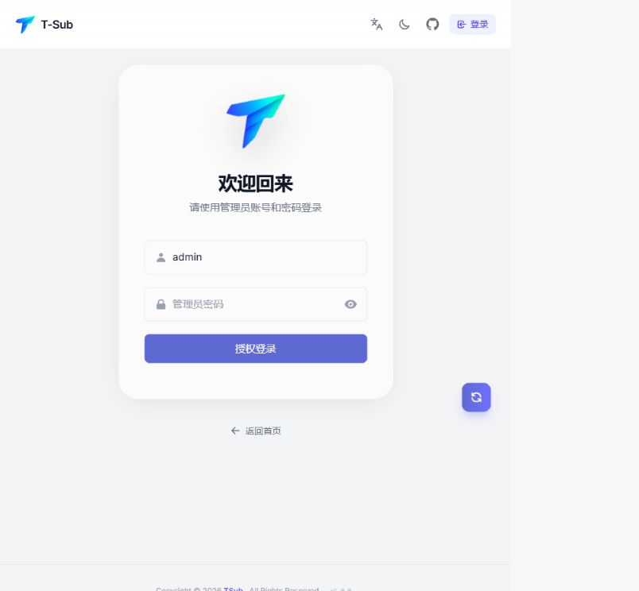

[简体中文](QUICK_START.md)

# GitHub Authorization Deployment

This guide deploys TSub from a GitHub fork through the Cloudflare Git integration. D1 full mode is recommended; KV basic mode is suitable for lightweight subscription management.

## Prerequisites

- A Cloudflare account that can create a Workers/Pages project, D1 database, and KV namespace.
- A GitHub account. Fork this repository and keep the fork public for the path below.
- An administrator password of at least eight characters and three different random Secrets.
- A stable HTTPS public URL if you use D1 full mode.

## 1. Fork the repository

Open <https://github.com/btjidi/TSub>, click **Fork**, and choose your GitHub account and repository name. Confirm that the fork is publicly reachable at `https://github.com/<your-account>/<your-repository>`.

Cloudflare only lists repositories available to the authorized GitHub account. Private repositories may require additional GitHub permissions and Cloudflare plan support; this guide uses a public fork.

## 2. Create the Cloudflare project

1. Sign in at <https://dash.cloudflare.com/>.
2. Open **Workers & Pages → Create application → Pages → Import existing Git repository**. If the first screen shows the Worker cards, click **Want to deploy Pages? Get started**. The button may also be labeled **Continue with GitHub**.
3. Authorize GitHub. If you choose selected repositories, grant access to your TSub fork.
4. Return to Cloudflare, select the fork, and click **Begin setup** or **Install & deploy**.



The authorization only needs repository access for builds. You can revoke it later from GitHub **Settings → Applications**.

## 3. Configure the build

Use these project settings:

| Setting | Value |
| --- | --- |
| Framework preset | `Vite` or `None` |
| Build command | `npm run build` |
| Build output directory | `dist` |
| Root directory | Repository root (empty or `/`) |
| Node.js version | `22` or later |

Save the project before deploying if you still need to add bindings or variables.



## 4. Choose storage

> [!CAUTION]
> Storage configuration now uses **Cloudflare dashboard bindings**. Select resources owned by your account under Pages **Settings → Bindings**. Never add account-specific KV/D1 IDs to the public `wrangler.toml`. Older forks should first remove legacy `[[kv_namespaces]]` and `[[d1_databases]]` sections.

Binding names are part of TSub's runtime contract: the application reads `TSUB_DB` and `TSUB_KV`. Do not bind two empty stores unless you intentionally set the initial storage policy.

### Recommended: D1 full mode

1. Open Cloudflare **Storage & databases → D1**, choose **Create database**, and create an empty database.
2. In the TSub project, open **Settings → Bindings** and add a D1 Database binding.
3. Set the variable name to `TSUB_DB`, select the new database, and save.
4. Do not add `TSUB_KV` or set `TSUB_INITIAL_STORAGE`.




The first request idempotently creates missing tables, indexes, and the unique `storage_control` record. No manual `schema.sql` step is required. D1 full mode enables proxy deployments, remote agents, command queues, and live heartbeats.

### Optional: KV basic mode

1. Open **Storage & databases → KV**, choose **Create namespace**, and create a namespace.
2. Add a KV Namespace binding in the TSub project.
3. Set the variable name to `TSUB_KV`, select the new namespace, and save.
4. Do not add `TSUB_DB` or set `TSUB_INITIAL_STORAGE`.




KV basic mode supports subscriptions, nodes, Profiles, one-time commands, and active push. It does not support remote agents, deployment commands, or live heartbeats.

### Existing KV to D1

Never switch existing data by changing bindings or environment variables alone. Keep `TSUB_KV`, create and bind `TSUB_DB`, redeploy, export a backup, and run the verified KV-to-D1 migration under Settings → System. TSub locks writes, copies records, verifies counts and the SHA-256 digest, and switches atomically.

## 5. Configure variables and Secrets

In **Settings → Variables and Secrets**, add these values for production. Encrypt sensitive values and never commit them to GitHub or `wrangler.toml`.

### Method A: Create variables manually

Click **Add variable**, enter each name and value, choose **Secret** for the password and three encryption keys, and save. Complete all six rows in the table before deploying.

| Name | Required | Purpose |
| --- | --- | --- |
| `ADMIN_USERNAME` | No | Administrator username, 3-32 characters; defaults to `admin` |
| `ADMIN_PASSWORD` | Yes | Administrator password, 8-128 characters |
| `COOKIE_SECRET` | Yes | Independent random value for login Cookie signing |
| `DEPLOYMENT_SECRET_KEY` | For deployments | Independent AES-GCM deployment configuration key |
| `SETTINGS_SECRET_KEY` | Recommended | Separate AES-GCM key for WebDAV, notifications, Cron, and External API Secrets |
| `TSUB_PUBLIC_URL` | Recommended | Public HTTPS URL, for example `https://tsub.example.com` |

### Method B: Import an `.env` template

In Cloudflare's Variables and Secrets section, click **Import .env**, paste this template, and replace every placeholder. The template contains names only; generate all `replace-with-...` values yourself and never commit the completed file to GitHub.

```dotenv
ADMIN_USERNAME=admin
ADMIN_PASSWORD=replace-with-a-new-admin-password
COOKIE_SECRET=replace-with-a-random-cookie-secret
DEPLOYMENT_SECRET_KEY=replace-with-a-random-deployment-key
SETTINGS_SECRET_KEY=replace-with-a-random-settings-key
TSUB_PUBLIC_URL=https://your-project.pages.dev
```

After import, confirm the target is **Production**, sensitive entries are stored as **Secrets**, and `TSUB_PUBLIC_URL` is stored as a regular text variable. Never expose these values in screenshots, logs, or the repository.

For compatibility, missing `SETTINGS_SECRET_KEY` falls back to `DEPLOYMENT_SECRET_KEY`, but new installations should set a separate value. Store all three encryption Secrets offline; ciphertext cannot be recovered from the database without the original keys.



## 6. Deploy and verify

1. Click **Save and Deploy** and wait for dependency installation, `npm run build`, and the publish step.
2. Open the assigned `*.pages.dev` URL and go to `/login`.
3. Sign in with `ADMIN_USERNAME` (or `admin`) and `ADMIN_PASSWORD`.
4. Open **Settings → System** and confirm the active D1 or KV storage and capability state.
5. Change the administrator credentials, sign in again, and configure backups, notifications, and the public page.
6. Add a source or node, create a Profile under My Subscriptions, and verify its output link.





In D1 mode, verify that remote agents and deployment commands are available. In KV mode, those controls should be visibly unavailable rather than reporting success.


## 7. Forks, dashboard bindings, and maintainer deploys

The public `wrangler.toml` contains only the project name, build output directory, compatibility date, and compatibility flags. It contains no Cloudflare Account ID, KV Namespace ID, or D1 Database ID, so syncing upstream cannot import the maintainer's resources.

For Cloudflare Git deployments, select resources owned by your account under Pages **Settings → Bindings** and use `TSUB_DB`/`TSUB_KV` as the binding names. Do not write those resource IDs back to `wrangler.toml`.

Forks upgrading from an older version should remove any legacy `[[kv_namespaces]]` and `[[d1_databases]]` sections from `wrangler.toml`, preserve their dashboard bindings, and redeploy.

Before a maintainer runs `npm run pages:verify` or `npm run deploy:pages`, copy `scripts/pages-production-target.example.json` to the Git-ignored `scripts/pages-production-target.local.json` and fill in the production resources. Environment variables are also supported: `TSUB_PAGES_PROJECT_NAME`, `TSUB_PAGES_PROJECT_SUBDOMAIN`, `TSUB_KV_NAMESPACE_ID`, `TSUB_D1_DATABASE_ID`, `TSUB_D1_DATABASE_NAME`, and `CLOUDFLARE_ACCOUNT_ID`. Supply the API token only through `CLOUDFLARE_API_TOKEN`; never store it in the target file.

## Troubleshooting

- **The repository is missing after GitHub authorization**: review Cloudflare's access under GitHub **Settings → Applications**, then re-authorize the fork.
- **Build failure**: verify the repository root, `npm run build`, `dist`, and Node.js 22+; fix the first error in the deployment log.
- **The app shows basic mode unexpectedly**: check that the binding name is exactly `TSUB_DB` or `TSUB_KV`, then redeploy.
- **`storage_initialization_failed` on the first D1 request**: check the D1 binding, account permissions, and deployment log; do not switch stores without a backup.
- **Password is rejected after adding variables**: confirm the variables are under **Production** and trigger a new deployment; Cloudflare does not inject new variables into an already completed deployment. The username must be 3-32 lowercase ASCII letters, digits, dots, underscores, or hyphens; it defaults to `admin`. Passwords must be 8-128 characters with no leading or trailing spaces.
- **Login immediately expires**: keep `COOKIE_SECRET` stable, use HTTPS, and preserve the forwarded protocol.
- **Public URLs are wrong**: set `TSUB_PUBLIC_URL` to the real HTTPS URL, redeploy, and check public-page settings.
- **An older fork references the original account**: sync the public `wrangler.toml` or remove its KV/D1 sections, bind resources owned by your account in Cloudflare, and redeploy.

## Screenshot checklist

Cloudflare labels vary by account, region, and product rollout. The pages listed in `docs/assets/screenshots/cloudflare/cloudflare-screenshot-checklist.txt` are included with account IDs, email addresses, passwords, Tokens, Cookies, and private GitHub details redacted. The public deployment URL is for demonstration only; use your own URL and secrets in production.

More: [User Guide](USER_GUIDE_EN.md) · [Operations](OPERATIONS_EN.md) · [Security](SECURITY_EN.md)
