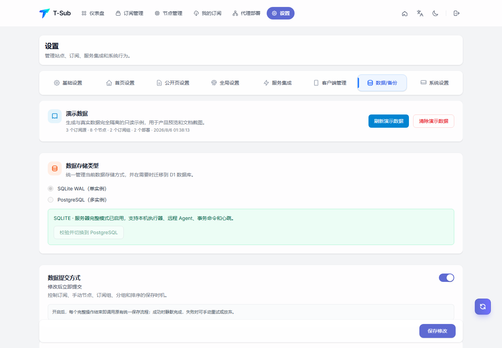
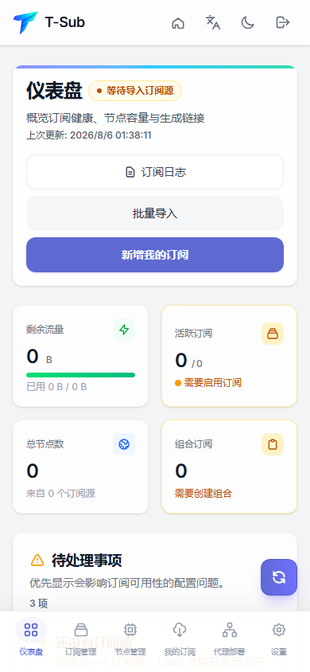

[English](USER_GUIDE_EN.md)

# 用户指南

## 导航

- **仪表盘**：查看订阅源、节点、Profile、流量和近期状态。
- **订阅管理**：管理普通订阅、主动推送源和安装快照。
- **节点管理**：管理单条分享链接、分组、延迟与批量操作。
- **我的订阅**：组合订阅源与节点，并输出客户端配置。
- **代理部署**：生成服务器部署命令、查看部署与操作历史。
- **设置**：管理站点、公开页、转换、集成、客户端、备份和认证。

## 订阅管理

支持新增、批量导入和文件导入。普通来源可刷新、编辑和禁用；部署产生的主动推送源由部署管理。主动推送卡片显示服务器地址、累计次数、最近五次推送、频率、预计下次推送和流量统计后端。

演示来源为只读，不可复制、刷新、编辑或删除。其数据只用于界面预览。

## 节点管理

支持 VLESS、Trojan、VMess、Hysteria2、TUIC、AnyTLS、Shadowsocks、SOCKS5 等分享链接。节点可分组、筛选、排序、去重、批量移动和连通性检查。演示节点不显示复制、测速、编辑或删除操作。

## 我的订阅

Profile 可组合多个订阅源与手动节点，设置客户端模板、规则级别、操作符链和公开状态。下载计数和访问日志用于运营观察；禁用 Profile 会立即停止公开输出。演示 Profile 不生成公开链接。

## 转换与操作符

内置转换器直接生成常用客户端格式。操作符按配置顺序执行，常见步骤包括协议过滤、名称匹配、地区识别、排序、去重、重命名和规则合并。远程脚本与 Fetch Proxy 会访问外部网络，只应配置可信地址。

## 设置与演示数据

系统设置中的“演示数据”可幂等生成、刷新或清除独立数据。演示数据不会进入公开订阅、Cron、Telegram、WebDAV、系统导出、External API 或部署回调。截图请求通过专用请求头只读取演示内容和脱敏设置。

## 移动端

窄屏使用顶部品牌栏与底部导航；列表、生成器和设置标签自动换行。

